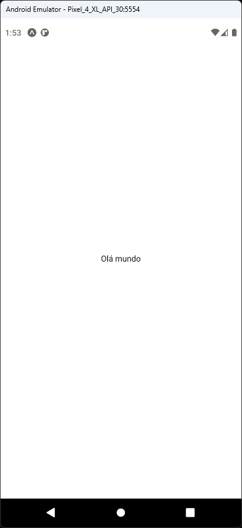

# Aula 04 - React Native

- É um framework para desenvolvimento de aplicações mobile multiplataforma (Android e iOS) usando JavaScript que tem como principal diferencial a conversão do código para o seu ambiente nativo de execução.

## Tela do Aplicativo

## Expo

- https://snack.expo.dev/@thomasdacostaprof/aula_04_1_olamundo

## Exercicios da Aula

- Inclua mais uma linha de texto com o descritivo "Olá Planeta" abaixo do texto "Olá Mundo" na tela do aplicativo.
- Siga os passos de configuração do ambiente de desenvolvimento para o React Native no Windows.
- Crie um novo projeto com Expo CLI e React Native CLI
