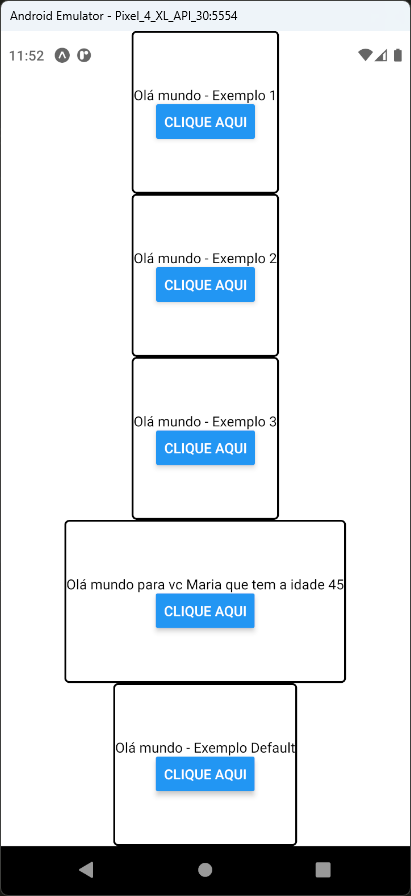

# Aula 05 - JavaScript - Functions e Arrow Functions

- É uma sintaxe em JavaScript para escrever funções de forma mais simplificada
- Podemos escrever funções com ou sem nome, diretamente nas chamadas e em uma única linha

## Tela do Aplicativo

## Expo

- https://snack.expo.dev/@thomasdacostaprof/aula_05_functions_arrow_functions

## Exercicios da Aula

- Criar uma função nova com dois campos de email e senha e um botão
- Ao clicar no botão deve ser exibido um alerta com o conteúdo dos campos de email e senha
- Utilizar o código do projeto da aula atual
- Importar a função criada no arquivo App.js
