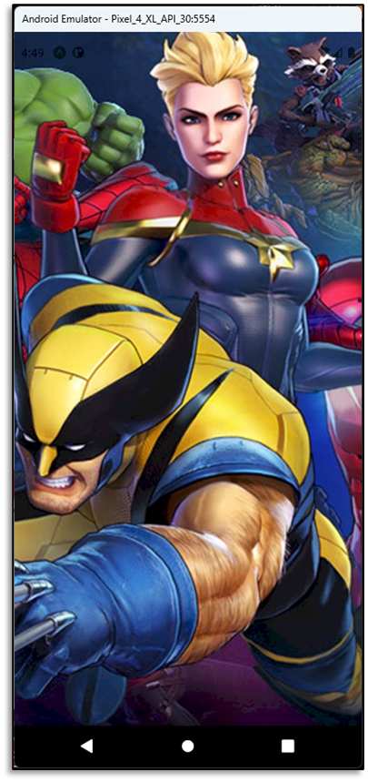

# Aula 06 - Componentes Visuais do React Native

- Componente ImageBackground

## Tela do Aplicativo

## Expo

- https://snack.expo.dev/@thomasdacostaprof/aula_06_7_componentes_visuais_imagebackground
