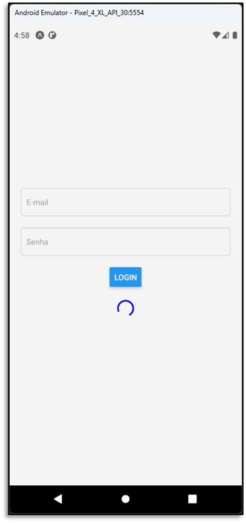

# Aula 06 - Componentes Visuais do React Native

- Componente ActivityIndicator

## Tela do Aplicativo

## Expo

- https://snack.expo.dev/@thomasdacostaprof/aula_06_8_componentes_visuais_activityindicator

