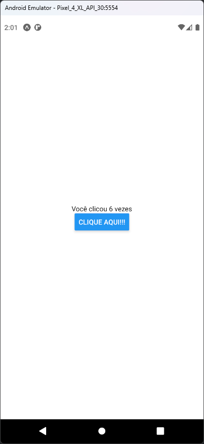

# Aula 07 - Hook - useState

## Tela do Aplicativo

## Exercicios da Aula

- Utilizar o código do projeto da aula atual
- Incluir mais um campo de texto e um botão novo na tela do aplicativo
- Criar uma variavel de estado para armazenar o valor do novo campo de texto chamada "dec" e "setDec"
- Criar uma função para atualizar o valor da variavel de estado "dec" chamada "handleDec"
- A função "handleDec" deve decrementar o valor da variavel de estado "dec" em 1 
- Criar um botão para atualizar o valor da variavel chamando a função "handleDec"
