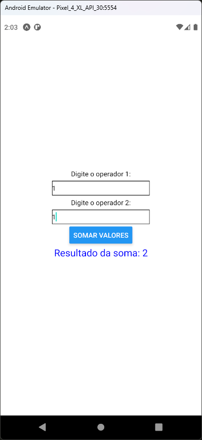

# Aula 07 - Hook - useState

Calculadora simples com React Native demonstrando o uso do Hook useState.

## Tela do Aplicativo

## Expo

- https://snack.expo.dev/@thomasdacostaprof/aula_07_2_calculadora

## Exercicios da Aula

- Criar os botões com as operações de subtração, multiplicação e divisão
- Criar um botão para limpar os campos de texto
- Não esqueça de incluir as variaveis de estado para armazenar os valores das operações
- Criar funções Javascript para cada operação e chamar a função correspondente quando o botão for clicado
