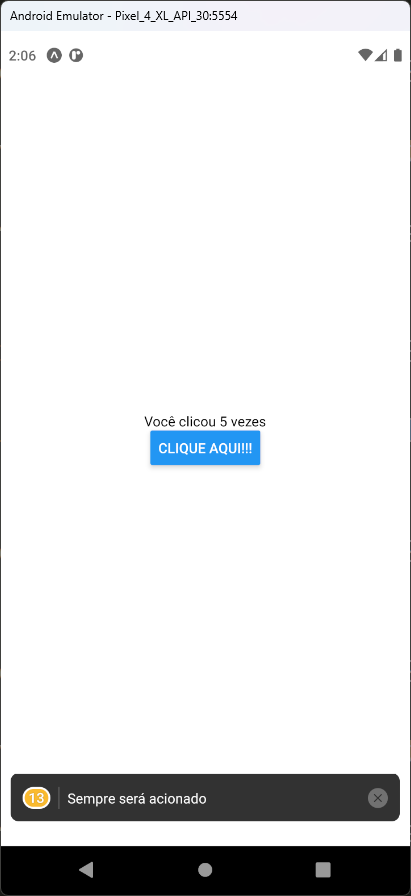
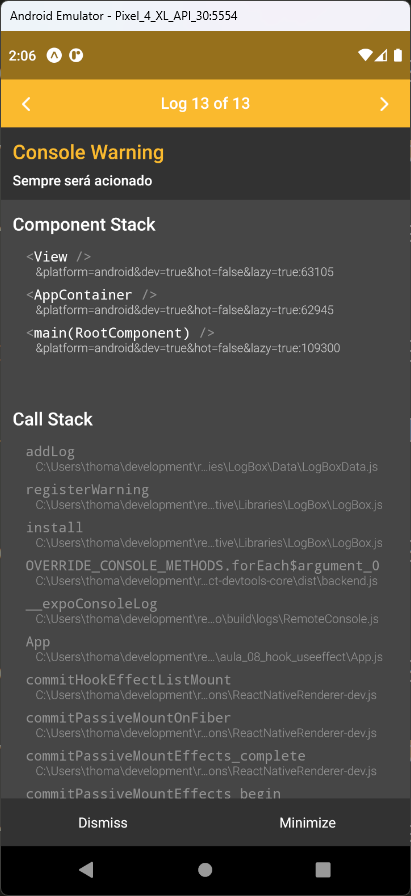

# Aula 08 - Hook - useEffect

É um Hook que é ativado quando algum componente ou a própria tela é renderizada. Podemos especificar quais componentes que ativam o hook.

## Tela do Aplicativo

 

## Expo

- https://snack.expo.dev/@thomasdacostaprof/aula_08_hook_useeffect

## Exercicios da Aula

- 
