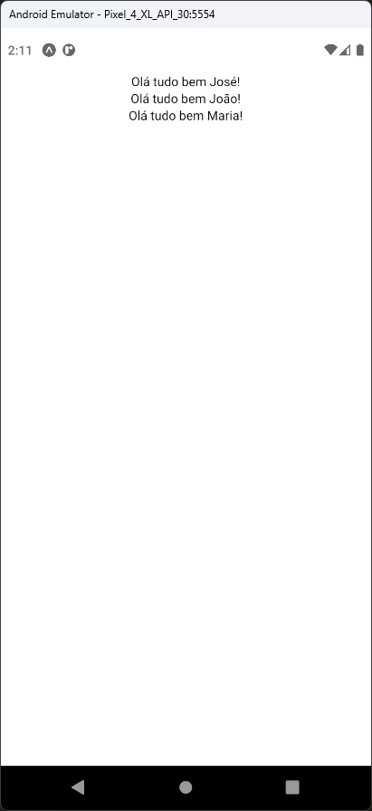

# Aula 09 - Componentização no React Native

- O React Native é baseado em componentes customizados ou da própria biblioteca
- Componentes customizados são os desenvolvidos para a nossa própria aplicação

## Tela do Aplicativo

 

## Expo

- https://snack.expo.dev/@thomasdacostaprof/aula_09_componentizacao_react_native

## Exercicios da Aula

- Crie um componente de login com os campos de usuário e senha
- Chame esse componente na tela principal da aplicação
