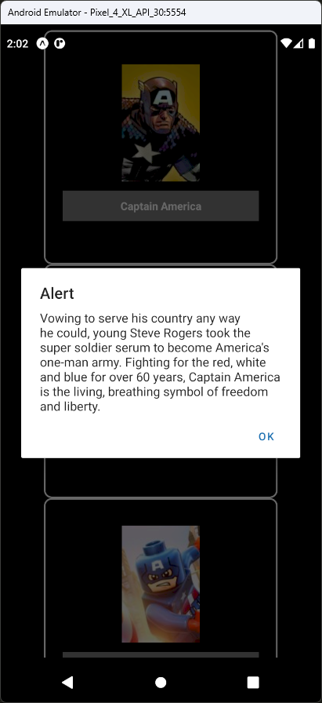

# Aula 10 - FlatList

- É uma forma de exibir uma lista de componentes
- Podemos exibir imagens, textos e outros componentes
- Componentes exibidos podem possuir interação a partir de seus eventos
- Similar a um componente de tabela de outras linguagens ou frameworks como Java

## Tela do Aplicativo

 

## Expo

- https://snack.expo.dev/@thomasdacostaprof/aula_10_1_flatlist

## Exercicios da Aula

- Incluir o campo "dataModificacao" em cada item dos personagens
- Incluir um campo a mais no vetor de personagens chamado "idade" e mostrar esse campo no item de cada personagem
- Modificar completamente a lista para incluir qualquer tipo de informação que desejar, como por exemplo uma lista de times de futebol
