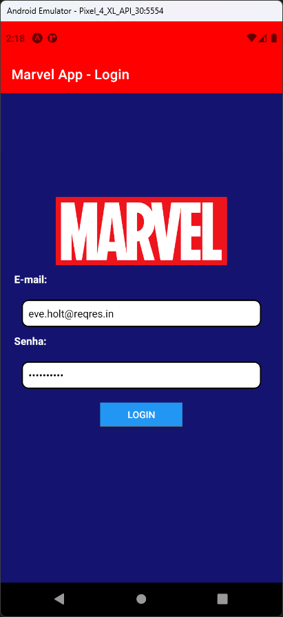

# Aula 11 - React Navigation

- É uma biblioteca para efetuar navegação entre fragmentos de tela do React Native
- Os fragmentos de tela, são funções Javascript que podem ficar dentro de um mesmo arquivo do React Native ou em arquivos diferentes
- Podemos efetuar a chamada para outros fragmentos através de comandos Javascript

## Tela do Aplicativo

  

## Expo

- https://snack.expo.dev/@thomasdacostaprof/aula_11_1_reactnavigation
