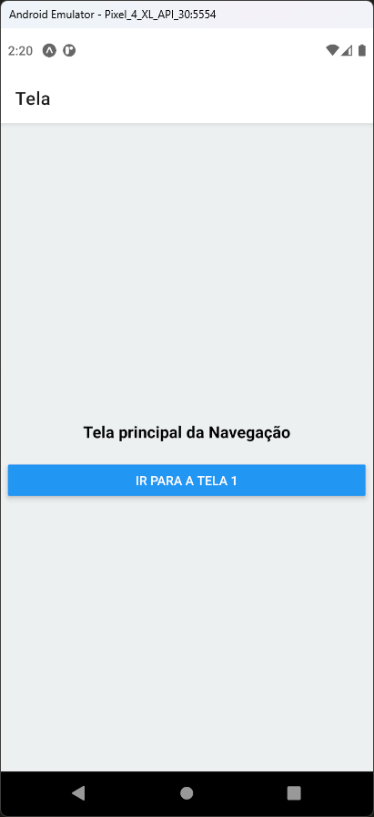
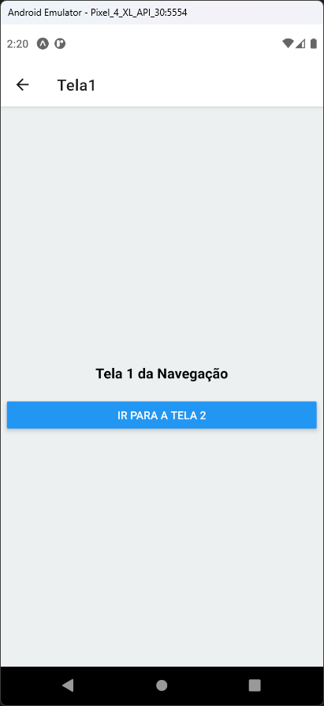
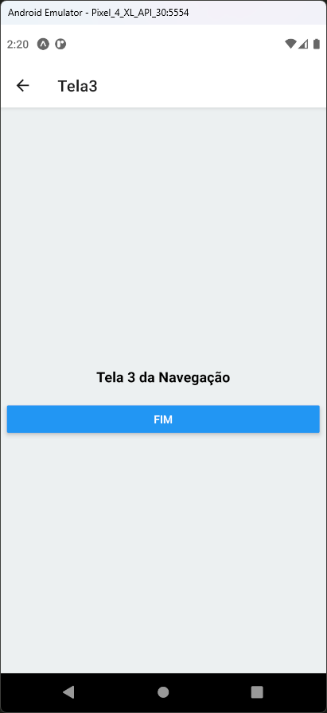
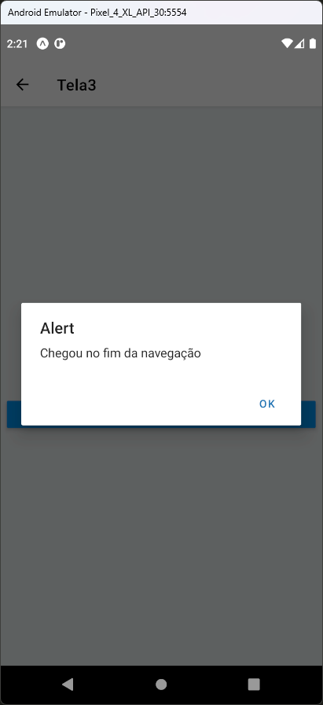

# Aula 11 - React Navigation

Exemplo simples de navegação entre telas utilizando o React Navigation

## Tela do Aplicativo

    

## Expo

- https://snack.expo.dev/@thomasdacostaprof/aula_11_2_reactnavigation

## Exercicios da Aula

- Utilizar o código do projeto da aula atual
- Criar uma nova tela chamada "Tela4"
- Criar um botão na tela "Tela3" para chamar a tela "Tela4"
- Incluir a "Tela4" no menu de navegação
