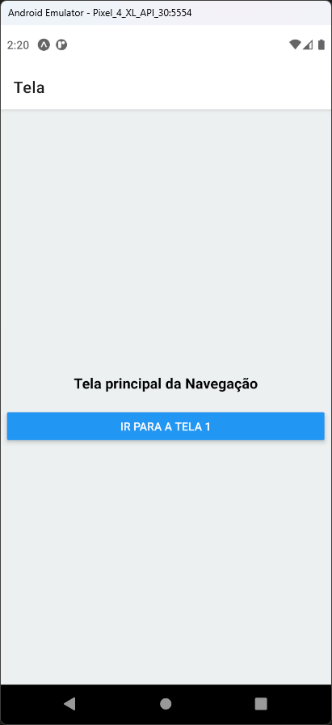
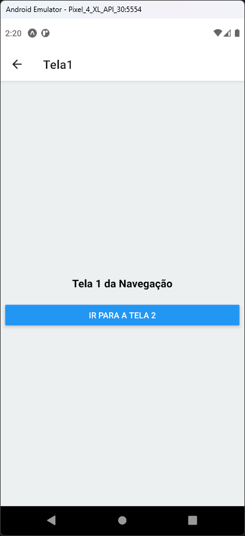
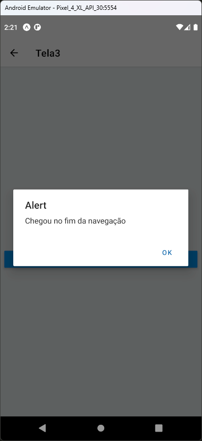

# Aula 11 - React Navigation

Exemplo simples de navegação entre telas utilizando o React Navigation

## Tela do Aplicativo

    

## Expo

- https://snack.expo.dev/@thomasdacostaprof/aula_11_3_reactnavigation
