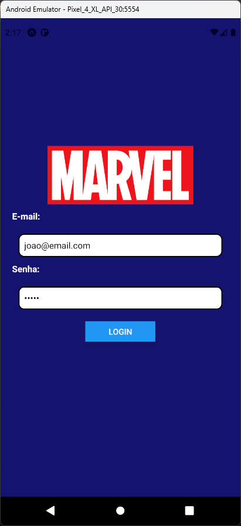
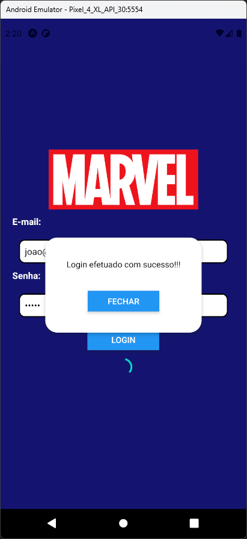

# Aula 12 - Modal

É um componente visual para apresentar um conteúdo acima de um outro fragmento de tela. Nesse tipo de visualização, a tela de fundo não fica acessível até que o Modal seja fechado.

## Tela do Aplicativo

 

## Expo

- https://snack.expo.dev/@thomasdacostaprof/aula_12_modal

## Exercicios da Aula

- Validar se o usuário e senha foram preenchidos conforme as variáveis EMAIL e SENHA
- Caso tenha digitado um valor diferente, mostrar um Modal com a mensagem de erro "Login ou senha inválidos"
- Criar um modal totalmente novo para exibir a mensagem de erro
