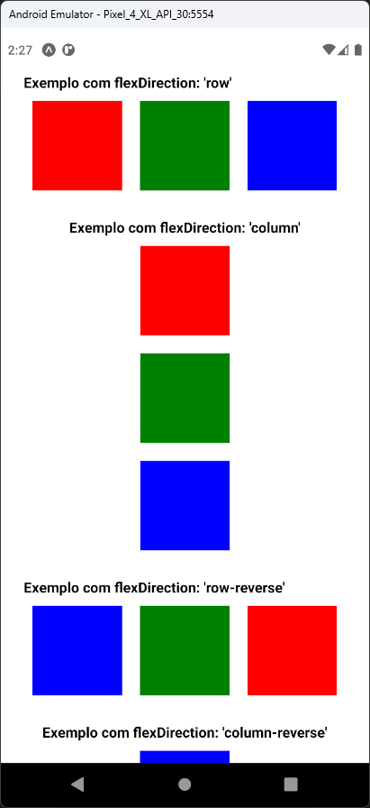
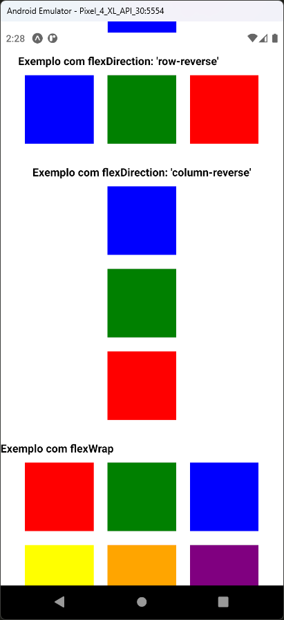
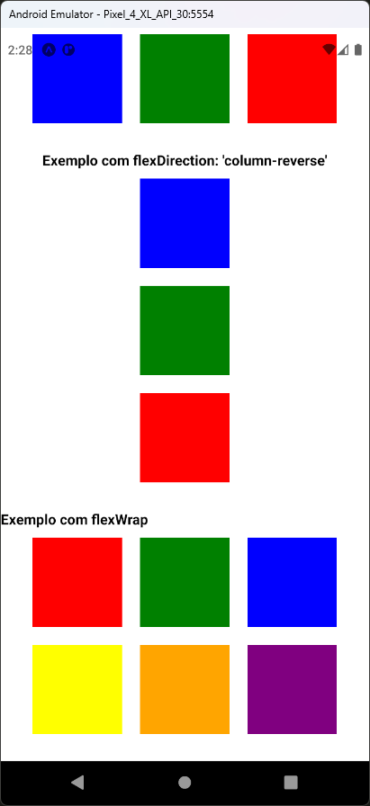

# Aula 13 - Flexbox

O Flexbox é uma ferramenta poderosa para criar layouts flexíveis e responsivos no React Native

## Tela do Aplicativo

   

## Expo

- https://snack.expo.dev/@thomasdacostaprof/aula_13_flexbox

## Exercicios da Aula

- A
