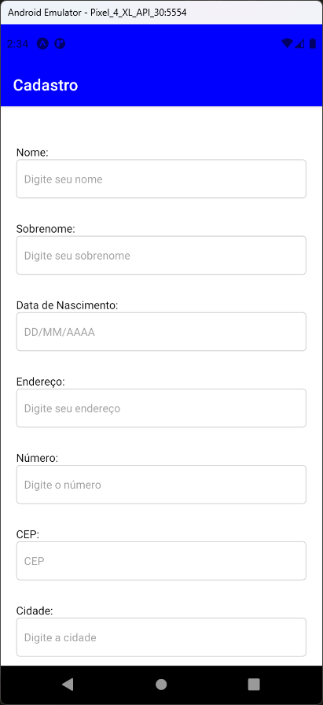
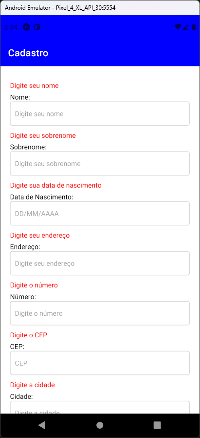
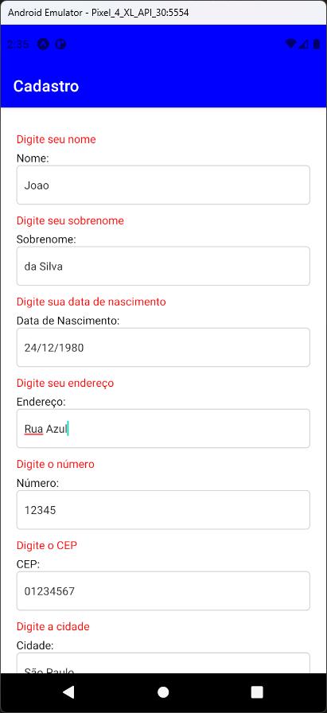
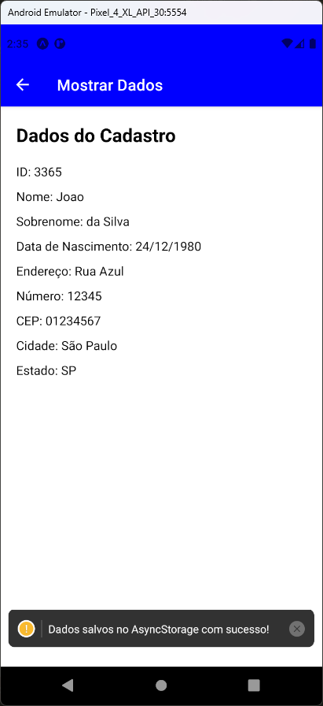

# Aula 14 – Armazenamento de Dados

- O AsyncStorage é uma API de armazenamento local no React Native, que permite que você salve dados de forma assíncrona no dispositivo do usuário
- Amplamente utilizado para armazenar informações localmente, como preferências do usuário, configurações, dados de login, cache de informações, entre outros

## Tela do Aplicativo

   

## Expo

- https://snack.expo.dev/@thomasdacostaprof/aula_14_1_armazenamento_asyncstorage

## Exercicios da Aula

- Criar uma tela para armazenar os dados de um formulário
- O formulário deve conter os seguintes campos:
  - Numero do Cartão de Crédito
  - Nome do Titular
  - Data de Validade
  - Código de Segurança
  - Bandeira
  - CPF
  - Telefone
  - E-mail
- A tela deve conter um botão para salvar os dados do formulário
- Esse formulário deve ser salvo no AsyncStorage
- A tela pode ser acessada através de um botão na tela principal ou através da última tela de dados cadastrais demonstrada no aplicativo
