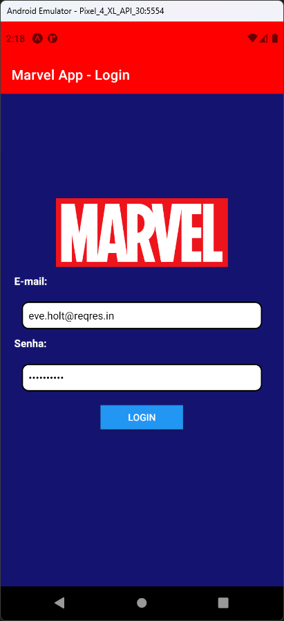
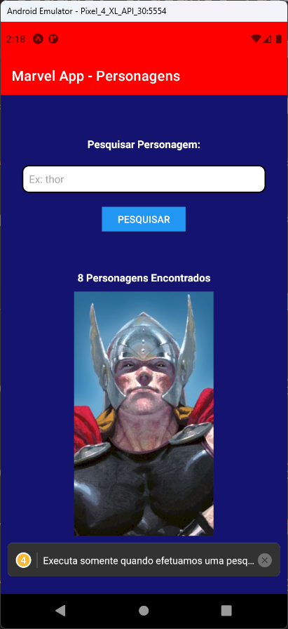
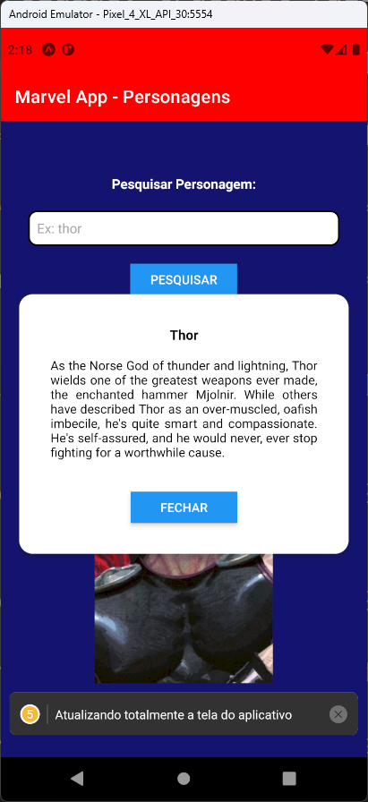

# Aula 15 - Promise e Fecth

- “Promise é um objeto usado para processamento assíncrono. Uma Promise representa um valor que pode estar disponível agora, no futuro ou nunca.”
- “A Fetch API fornece uma interface para buscar recursos (por exemplo, em toda a rede). Parecerá familiar para qualquer pessoa que tenha usado XMLHttpRequest, porém a nova API oferece um conjunto de recursos mais poderoso e flexível.”

## Tela do Aplicativo

  

## Expo

- https://snack.expo.dev/@thomasdacostaprof/aula_15_promise_fecth

## Exercicios da Aula

- Criar uma nova aplicação
- Utilizar qualquer operação de API do site https://reqres.in/
- Criar a tela para essa aplicação. Por exemplo uma lista de usuários, cadastro de usuário, etc.
