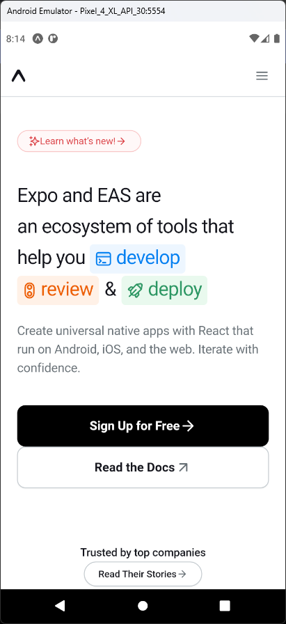

# Aula 16 - WebView

- O WebView é um componente fornecido pelo React Native que permite integrar conteúdo web dentro de um aplicativo React Native

## Tela do Aplicativo

## Expo

- https://snack.expo.dev/@thomasdacostaprof/aula_16_webview
