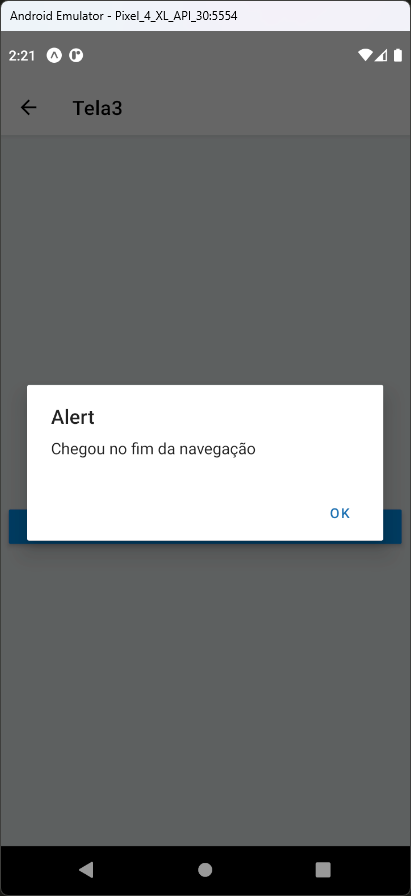

# Aula 17 – Context API

A Context API é uma das APIs mais importantes oferecidas pelo React para gerenciar o estado e propriedades de forma eficiente, especialmente quando você precisa passar dados através da árvore de componentes sem ter que passá-los manualmente através de props em cada nível.

## Tela do Aplicativo

    

## Expo

- https://snack.expo.dev/@thomasdacostaprof/aula_17_contextapi
