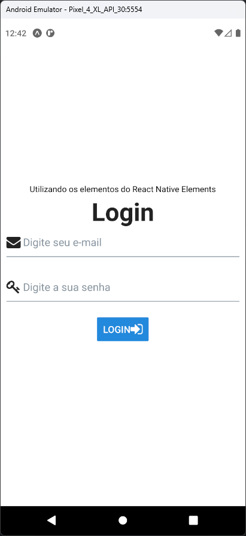

# Aula 18 - React Native Elements

- O React Native Elements é uma biblioteca UI (Interface do Usuário) popular para React Native, que permite aos desenvolvedores criar interfaces de usuário atraentes e responsivas para aplicativos móveis usando o React Native

## Tela do Aplicativo

## Expo

- https://snack.expo.dev/@thomasdacostaprof/aula_18_reactnativeelements

## Exercicios da Aula

- Criar um exemplo de uso dos componentes do React Native Elements
- O exericio é livre, mas deve conter pelo menos 5 componentes diferentes
